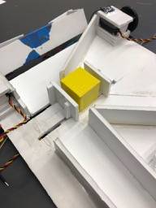

# Week 7

This week we built out a first prototype of the sliding chamber mechanism that we will use to sort blocks. The current prototype of the chamber holds one block, and then will not move if we want to keep the block, or move the block to the left or right if we want to discard it. The sliding chamber will be moved through a servo, gear, and gear rack combination on the top of the body.

## Photos

