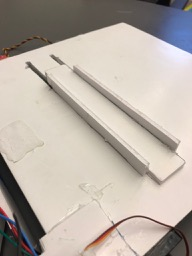

# Week 7

This week we built out a first prototype of the sliding chamber mechanism that we will use to sort blocks. The current prototype of the chamber holds one block, and then will not move if we want to keep the block, or move the block to the left or right if we want to discard it. The sliding chamber will be moved through a servo, gear, and gear rack combination on the top of the body. Gabe and Eliana designed and implemented this first iteration of the chamber.

## Future Plans

Our plans for the next couple of weeks is to work on building a 3D model of our robot in Tinkercad, and then printing certain pieces of the robot. We plan to print mounts for the servo motors, in order to make sure that they stay aligned straight. We wil also print mounts/gears for the servos on top that will be used for the front flap as well as the sliding chamber. Eliana has started the process of building the 3D model.

## Issues

We anticipate having to design multiple iterations of our chamber mechanism. This initial design is to show how we would be able to create something that is able to slide back and forth on the underside of the robot. Our next iteration will be designed to ensure that we can store or discard the appropriate blocks. This will involve an additional wall on the back of the chamber as well as a color sensor to make sure we know the color and position of the blocks in the chamber, since it is very important we are not storing blocks of the wrong color.

## Photos

